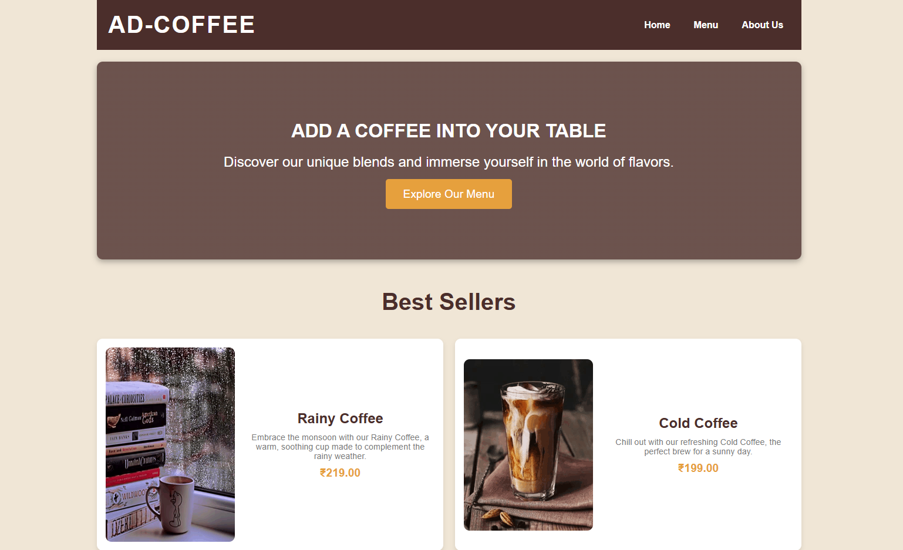
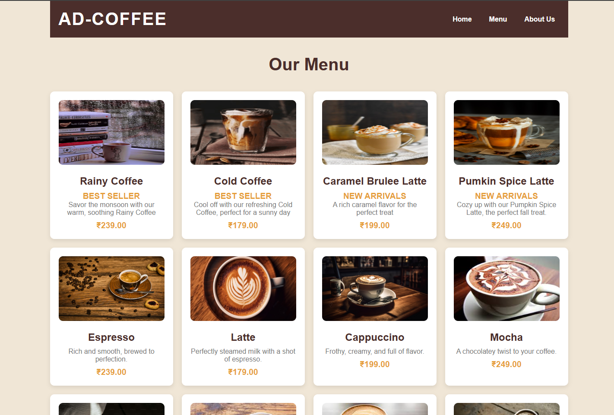
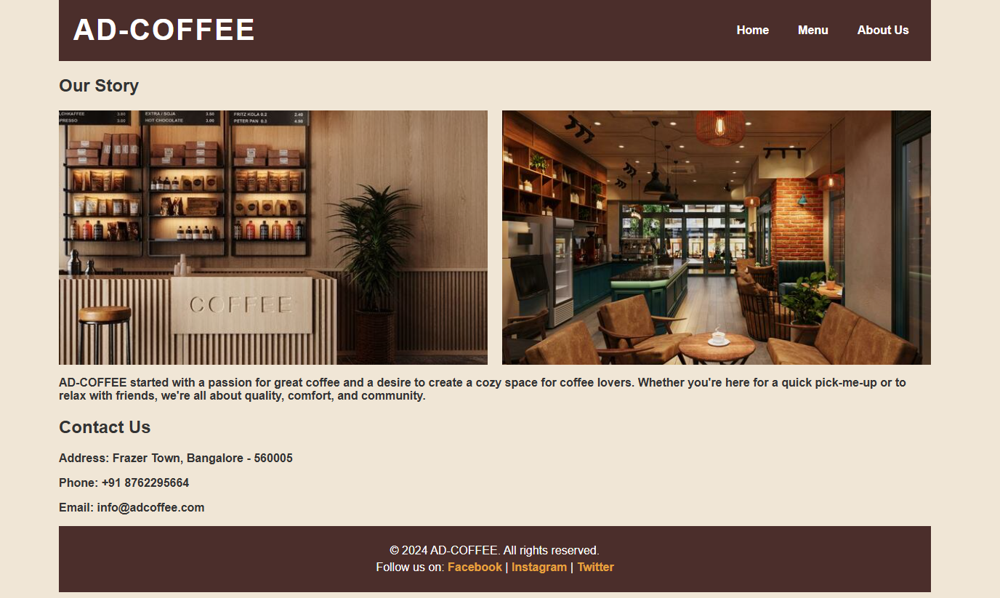

# ☕ AD-COFFEE

**AD-COFFEE** is a responsive and visually appealing coffee shop website built using **HTML** and **CSS**. It features a clean, modern design with intuitive navigation, showcasing the ambiance and offerings of a fictional café.

---

## 📸 Preview

### Link - https://raquib-adnan.github.io/AD-COFFEE/

### 🏠 Home Page



### 📋 Menu Page



### 📖 About Page



---

## ✨ Features

- **Responsive Design**: Ensures optimal viewing across various devices.
- **Clean Layout**: Utilizes modern design principles for a user-friendly interface.
- **Semantic HTML**: Enhances accessibility and SEO.
- **Modular CSS**: Facilitates easy customization and maintenance.

---

## 📄 Pages

### 🏠 Home Page (`index.html`)

- Features a prominent banner image.
- Introduces the coffee shop's ambiance and specialties.

### 📋 Menu Page (`menu.html`)

- Showcases a variety of coffee products with descriptions and prices.

### ℹ️ About Page (`about.html`)

- Shares the story behind AD-COFFEE.
- Provides location details and contact information.

---

## 🚀 Getting Started

To view the website locally:

1. **Clone the repository**:

   ```bash
   git clone https://github.com/raquib-adnan/AD-COFFEE.git
